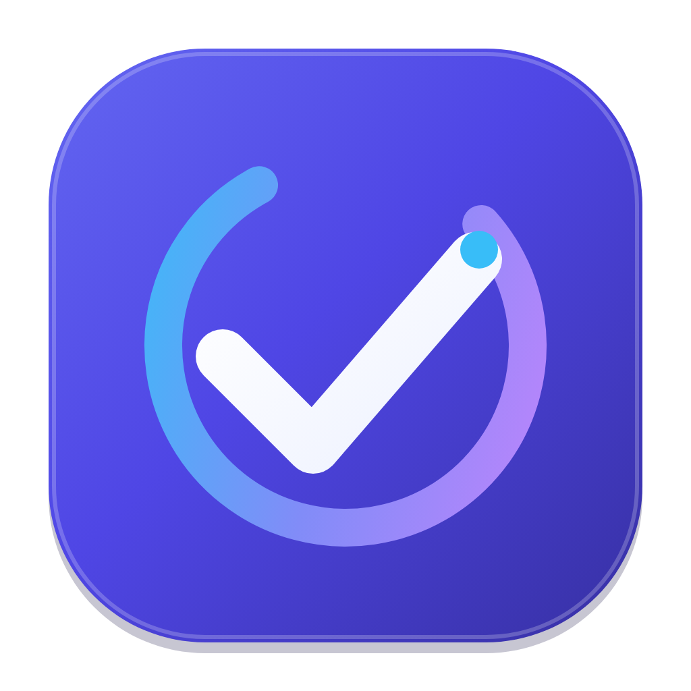

<p align="center">
  
</p>

<h1 align="center">TodO</h1>

<p align="center">
  Rencanakan hari, fokus pada prioritas, dan selesaikan tugas dengan lebih teratur.
</p>

<p align="center">
  
  
  
</p>

TodO adalah aplikasi daftar tugas (to-do list) Android berbasis Flutter. Atur
tugas dan deadline, susun prioritas, gunakan timer fokus, lalu pantau progres
melalui kalender dan analitik. Tugas serta pengaturan disimpan secara lokal di
perangkat; aplikasi tidak memerlukan akun atau server.

> **Versi saat ini:** `1.0.4` (build `5`) · **Application ID Android:** `my.id.fads.todo`

---

## Daftar Isi

- [Fitur](#fitur)
- [Mulai Menggunakan Aplikasi](#mulai-menggunakan-aplikasi)
- [Persyaratan Pengembangan](#persyaratan-pengembangan)
- [Menjalankan di Windows](#menjalankan-di-windows)
- [Cara Menggunakan](#cara-menggunakan)
- [Penyimpanan dan Cadangan](#penyimpanan-dan-cadangan)
- [Notifikasi Android](#notifikasi-android)
- [Build Rilis Android](#build-rilis-android)
- [Struktur Proyek](#struktur-proyek)
- [Teknologi](#teknologi)
- [Pengujian dan Analisis](#pengujian-dan-analisis)
- [Pemecahan Masalah](#pemecahan-masalah)
- [Mengganti Logo](#mengganti-logo)
- [Privasi, Lisensi, dan Kontribusi](#privasi-lisensi-dan-kontribusi)

## Fitur

| Fitur | Penjelasan |
| --- | --- |
| **Manajemen tugas** | Tambah, edit, hapus, pin, dan tandai tugas selesai. Tambahkan catatan, deadline, prioritas, kategori, dan checklist sub-tugas. |
| **Pencarian dan pengurutan** | Cari judul, catatan, atau sub-tugas. Filter status, kategori, dan prioritas; urutkan berdasarkan deadline, prioritas, waktu dibuat, atau judul. |
| **Kategori** | Kelola kategori dengan warna dan ikon. Kategori yang masih digunakan oleh tugas tidak dapat dihapus. |
| **Tugas berulang** | Atur pengulangan harian, mingguan, atau bulanan. Tugas berulang dijadwalkan ke siklus berikutnya saat diselesaikan. |
| **Pengingat lokal** | Atur pengingat 5, 10, 15, 30, atau 60 menit sebelum deadline, pilih suara, dan tunda notifikasi tugas selama 10 menit. |
| **Ringkasan** | Aktifkan ringkasan tugas harian dan tinjauan mingguan secara terpisah dari pengingat deadline. |
| **Kalender** | Lihat deadline dan tugas pada kalender bulanan. |
| **Timer Pomodoro** | Jalankan sesi fokus, istirahat singkat, dan istirahat panjang; jeda, reset, atau lewati fase dan hubungkan timer dengan tugas. Pilihan fokus tersedia 15, 25, atau 50 menit. |
| **Analitik** | Lihat tingkat penyelesaian, jumlah tugas selesai dalam 7 hari terakhir, serta distribusi berdasarkan kategori dan prioritas. |
| **Tema** | Pilih tampilan terang atau gelap. |
| **Cadangan dan pemulihan** | Ekspor tugas, kategori, dan pengaturan ke JSON, lalu pulihkan dengan menggabungkan atau mengganti data yang ada. |
| **Panduan awal** | Ikuti tutorial singkat, lalu pilih memulai dengan data contoh atau daftar kosong. |

## Mulai Menggunakan Aplikasi

Jika Anda hanya ingin memakai TodO, unduh APK rilis yang disediakan pada
halaman distribusi proyek atau dari penerbit aplikasi. Pada Android, izinkan
pemasangan dari sumber yang Anda gunakan jika diminta, lalu buka file APK untuk
menginstalnya.

Setelah aplikasi dibuka:

1. Ikuti atau lewati tutorial pengenalan.
2. Pilih memakai tugas contoh atau mulai dengan daftar kosong.
3. Tekan tombol **+** untuk membuat tugas pertama.
4. Izinkan notifikasi jika ingin menerima pengingat tugas atau ringkasan.

Data baru tersimpan di perangkat yang digunakan. Untuk memindahkan data ke
perangkat lain, ekspor cadangan dari perangkat lama dan pulihkan file cadangan
tersebut di perangkat baru.

## Persyaratan Pengembangan

Untuk menjalankan atau membangun aplikasi dari kode sumber, siapkan:

- **Git** untuk mengambil kode sumber.
- **Flutter SDK** yang menyertakan **Dart 3.11.0 atau lebih baru**. Batas versi
  SDK ditetapkan di [`pubspec.yaml`](./pubspec.yaml).
- **Android Studio** dengan Android SDK dan Android SDK Command-line Tools,
  atau instalasi Android SDK yang sudah dikonfigurasi.
- **Java JDK 17** untuk proses build Android.
- **Emulator Android** atau perangkat Android dengan USB debugging untuk
  menjalankan aplikasi.

Periksa instalasi sebelum melanjutkan:

```powershell
flutter --version
flutter doctor -v
```

Flutter yang terlalu lama tidak memenuhi batas Dart pada proyek ini. Pasang
Flutter stable versi terbaru yang tersedia jika versi Dart yang ditampilkan
lebih rendah dari 3.11.

## Menjalankan di Windows

### 1. Ambil kode sumber

Buka PowerShell, lalu jalankan:

```powershell
git clone https://github.com/fdhlurohman/TodO.git
Set-Location TodO
```

Jika kode sumber sudah tersedia di komputer, buka PowerShell dari folder
proyek—folder yang berisi `pubspec.yaml`—dan lanjutkan ke langkah berikutnya.

### 2. Siapkan Android SDK

Pasang Android Studio dan Android SDK, atau gunakan instalasi SDK yang sudah
ada. Pastikan Android SDK Command-line Tools terpasang, kemudian setujui
lisensi Android:

```powershell
flutter doctor --android-licenses
flutter doctor -v
```

Ikuti petunjuk pada terminal sampai lisensi diterima. Jika belum memiliki
perangkat atau emulator yang berjalan, buka **Android Studio → Device
Manager** untuk membuat dan menjalankan emulator.

### 3. Unduh dependensi proyek

Dari direktori yang berisi `pubspec.yaml`, jalankan:

```powershell
flutter pub get
```

### 4. Jalankan aplikasi

Pastikan perangkat Android atau emulator terdeteksi:

```powershell
flutter devices
```

Kemudian jalankan:

```powershell
flutter run
```

Jika ada beberapa perangkat, tentukan ID perangkat yang ditampilkan oleh
`flutter devices`:

```powershell
flutter run -d <device-id>
```

Contoh: `flutter run -d emulator-5554`. Proyek sudah memiliki konfigurasi
Android, izin notifikasi, dan receiver notifikasi. **Jangan** menjalankan
`flutter create .` atau menambahkan receiver secara manual untuk setup biasa.

## Cara Menggunakan

### Membuat dan mengelola tugas

1. Dari tab **Beranda**, tekan tombol **+**.
2. Masukkan judul dan detail tugas yang diperlukan.
3. Atur kategori, prioritas, deadline, pengulangan, pengingat, atau sub-tugas.
4. Simpan tugas. Tandai selesai dari daftar; tugas berulang akan berpindah ke
   jadwal berikutnya saat diselesaikan.

Gunakan pencarian, filter status/kategori/prioritas, dan pilihan urutkan di
Beranda untuk menemukan tugas. Tugas yang dipin selalu tampil di bagian atas.

### Navigasi utama

Aplikasi memiliki empat tab navigasi:

- **Beranda** — daftar tugas, pencarian, filter, dan ringkasan singkat.
- **Kalender** — jadwal tugas berdasarkan tanggal.
- **Analitik** — statistik dan grafik progres.
- **Pengaturan** — tema, kategori, notifikasi, data dan cadangan, serta akses
  ke timer fokus dan panduan.

### Timer fokus

Buka **Pengaturan → Timer fokus (Pomodoro)**. Pilih durasi fokus 15, 25, atau
50 menit, lalu gunakan tombol mulai/jeda, reset, atau lewati fase. Siklus
standarnya memberikan istirahat 5 menit setelah sesi fokus dan istirahat
panjang 15 menit setelah empat sesi fokus. Hubungkan timer dengan tugas jika
ingin menampilkan tugas yang sedang dikerjakan.

## Penyimpanan dan Cadangan

TodO menggunakan **Hive** untuk menyimpan data secara lokal di perangkat:
tugas, kategori, serta preferensi aplikasi. Aplikasi tidak mengirim data tugas
ke server. Data dapat hilang jika data aplikasi dihapus atau aplikasi
dicopot; file cadangan yang sudah diekspor harus dikelola terpisah.

### Ekspor cadangan

1. Buka **Pengaturan → Data & cadangan**.
2. Pilih ekspor cadangan, lalu tentukan lokasi penyimpanan atau aplikasi tujuan
   berbagi.
3. Simpan file JSON di lokasi aman yang dapat Anda akses kembali.

### Pulihkan cadangan

1. Buka **Pengaturan → Data & cadangan** pada TodO.
2. Pilih file cadangan JSON yang sebelumnya diekspor.
3. Tinjau isinya dan pilih **gabungkan** dengan data yang ada atau **ganti**
   data yang ada.

Memilih ganti akan menggantikan data aplikasi yang tersimpan saat ini. File
cadangan divalidasi sebelum dipulihkan; format yang tidak didukung atau file
lebih dari 10 MB akan ditolak. Pilihan suara notifikasi dari perangkat tidak
ikut dicadangkan karena URI suara hanya berlaku pada perangkat asal.

## Notifikasi Android

- TodO memakai notifikasi lokal Android. Konten pengingat berasal dari data
  tugas pada perangkat.
- Izin notifikasi Android 13+ diminta ketika notifikasi diaktifkan. Jika izin
  ditolak, tugas tetap tersimpan, tetapi notifikasinya tidak akan ditampilkan.
- Pengingat deadline, ringkasan harian, dan tinjauan mingguan memiliki
  pengaturan masing-masing. Pengingat deadline dapat diaktifkan atau
  dinonaktifkan secara global dari Pengaturan.
- Jeda pengingat yang tersedia adalah **5, 10, 15, 30, dan 60 menit**. Jika
  deadline lebih dekat daripada jeda yang dipilih, pengingat dijadwalkan pada
  waktu deadline. Pengingat tidak dijadwalkan untuk deadline yang sudah lewat.
- Anda dapat memilih suara bawaan TodO, suara dari perangkat, atau senyap.
  Android dapat membatasi alarm tepat waktu jika izin **Alarms & reminders**
  tidak diaktifkan; dalam kondisi tersebut, pengiriman dapat tertunda.
- Receiver untuk alarm terjadwal dan pemulihan jadwal setelah perangkat
  dimulai ulang sudah terdaftar di
  [`AndroidManifest.xml`](./android/app/src/main/AndroidManifest.xml).

## Build Rilis Android

Gunakan langkah ini jika Anda mengembangkan aplikasi atau ingin membuat
artefak rilis sendiri. Build rilis memerlukan **keystore dan konfigurasi
signing milik Anda sendiri**. Jangan membagikan atau memasukkan file keystore
dan kata sandinya ke repository.

### 1. Buat keystore upload

Pastikan JDK 17 terpasang dan `keytool` tersedia pada `PATH`. Di PowerShell,
jalankan perintah berikut dari direktori proyek:

```powershell
keytool -genkeypair -v -keystore android/app/todo-upload.jks -keyalg RSA -keysize 2048 -validity 10000 -alias todo-upload
```

Ikuti pertanyaan `keytool` untuk membuat kata sandi dan informasi keystore.
Simpan kata sandi dengan aman. Jika sudah mempunyai keystore sendiri, Anda
dapat menggunakannya dan menyesuaikan nilai `storeFile`.

### 2. Buat konfigurasi signing lokal

Salin template yang disediakan:

```powershell
Copy-Item android/key.properties.example android/key.properties
notepad android/key.properties
```

Isi properti berikut dengan nilai yang sesuai dengan keystore Anda:

```properties
applicationId=my.id.fads.todo
storeFile=app/todo-upload.jks
storePassword=PASSWORD_KEYSTORE_ANDA
keyAlias=todo-upload
keyPassword=PASSWORD_KEY_ANDA
```

`storeFile` adalah path relatif terhadap folder `android`, sehingga contoh di
atas menunjuk ke `android/app/todo-upload.jks`. Jika keystore berada di lokasi
lain, sesuaikan path-nya. Simpan `key.properties` secara lokal—file ini dan
file `*.jks`/`*.keystore` diabaikan oleh Git. Jangan menempelkan kata sandi
asli ke dokumentasi, chat, atau repository.

> **Penting:** simpan salinan aman keystore dan kata sandinya. Kehilangan
> keystore dapat menghalangi Anda menandatangani pembaruan aplikasi dengan
> kunci yang sama.

### 3. Pilih format rilis

Jalankan **salah satu** perintah berikut sesuai kebutuhan:

```powershell
# Satu APK untuk dibagikan atau dipasang secara manual
flutter build apk --release

# APK terpisah untuk setiap arsitektur perangkat
flutter build apk --release --split-per-abi

# Android App Bundle untuk diunggah ke Google Play
flutter build appbundle --release
```

| Format | Cocok untuk | Hasil |
| --- | --- | --- |
| **APK universal** | Instalasi manual, pengujian, atau berbagi satu file APK. Mendukung beberapa arsitektur, tetapi ukuran file biasanya lebih besar. | `build/app/outputs/flutter-apk/app-release.apk` |
| **APK per-ABI** | Distribusi manual saat Anda dapat memilih APK sesuai arsitektur perangkat. Setiap APK lebih kecil, tetapi tidak satu file untuk semua perangkat. | `build/app/outputs/flutter-apk/app-armeabi-v7a-release.apk`<br>`build/app/outputs/flutter-apk/app-arm64-v8a-release.apk`<br>`build/app/outputs/flutter-apk/app-x86_64-release.apk` |
| **Android App Bundle (AAB)** | Publikasi melalui Google Play. Play membuat APK yang sesuai untuk perangkat pengguna. AAB bukan file APK tunggal untuk dipasang langsung. | `build/app/outputs/bundle/release/app-release.aab` |

Untuk menginstal APK melalui perangkat yang terhubung, gunakan APK universal:

```powershell
adb install -r build/app/outputs/flutter-apk/app-release.apk
```

Application ID rilis ditetapkan sebagai `my.id.fads.todo` oleh konfigurasi
Android. Pertahankan ID dan kunci signing yang sama untuk menerbitkan
pembaruan aplikasi yang sama. Jangan membagikan APK atau AAB sebagai rilis
resmi sebelum memastikan artefak ditandatangani dengan keystore rilis Anda.

## Struktur Proyek

```text
.
├── android/                   # Proyek Android, manifest, dan build Gradle
├── assets/
│   └── logo/                  # Logo SVG dan PNG
├── lib/
│   ├── core/
│   │   ├── theme/             # Tema terang dan gelap
│   │   └── utils/             # Utilitas tanggal dan ID
│   ├── data/                  # Repository Hive dan ekspor/pemulihan cadangan
│   ├── models/                # Model tugas, kategori, prioritas, sub-tugas
│   │                          # dan pengulangan
│   ├── providers/             # State dan logika fitur aplikasi
│   ├── screens/               # Halaman beranda, kalender, analitik, dan lainnya
│   ├── services/              # Layanan notifikasi lokal
│   └── widgets/               # Komponen UI yang digunakan ulang
├── test/                      # Pengujian unit dan widget
├── tool/branding/             # Aset dan alat bantu branding Android
├── analysis_options.yaml      # Aturan analisis dan lint Dart
├── pubspec.yaml               # Metadata, batas SDK, dependensi, dan aset
└── pubspec.lock               # Versi dependensi yang dikunci
```

## Teknologi

- **Flutter / Dart** — aplikasi Android dan antarmuka.
- **Provider** — state management.
- **Hive / hive_flutter** — penyimpanan lokal.
- **flutter_local_notifications**, **flutter_timezone**, **timezone** — notifikasi
  dan penjadwalan waktu lokal.
- **table_calendar** — tampilan kalender.
- **fl_chart** — grafik analitik.
- **flutter_svg** — tampilan logo SVG.
- **file_picker / share_plus** — pemilihan dan berbagi file cadangan.

## Pengujian dan Analisis

Jalankan perintah berikut dari direktori proyek:

```powershell
# Memeriksa masalah statis Dart/Flutter
flutter analyze

# Menjalankan seluruh unit test dan widget test
flutter test
```

Test mencakup model, provider tugas, kalender, timer Pomodoro, formulir tugas,
cadangan, serta perilaku UI. Sebelum mengirim perubahan, jalankan kedua
perintah dan pastikan proses berakhir tanpa error.

## Pemecahan Masalah

| Gejala | Yang perlu diperiksa |
| --- | --- |
| `flutter` tidak dikenali | Pastikan Flutter SDK terpasang dan folder `bin` Flutter sudah ditambahkan ke `PATH`. Tutup dan buka ulang terminal setelah mengubah `PATH`. |
| Versi Dart tidak memenuhi syarat | Periksa `flutter --version`. Pasang Flutter stable yang menyertakan Dart 3.11.0 atau lebih baru. |
| Android toolchain bermasalah | Jalankan `flutter doctor -v`, lengkapi komponen Android SDK yang diminta, lalu jalankan `flutter doctor --android-licenses` dan terima lisensinya. |
| Tidak ada perangkat untuk `flutter run` | Jalankan emulator dari Android Studio Device Manager atau sambungkan perangkat dengan USB debugging aktif. Periksa hasil `flutter devices` dan `adb devices`. |
| `pub get` gagal | Pastikan koneksi internet tersedia, jalankan dari folder yang berisi `pubspec.yaml`, dan pastikan Flutter/Dart memenuhi batas versi proyek. |
| Build Android gagal terkait Java | Pastikan Gradle memakai JDK 17. Periksa `flutter doctor -v` dan konfigurasi JDK di Android Studio. |
| Build tampak memakai cache lama | Jalankan `flutter clean`, lalu `flutter pub get` dan ulangi perintah build. Perintah ini menghapus artefak build, bukan source code. |
| Build release meminta konfigurasi signing | Ikuti langkah [Build Rilis Android](#build-rilis-android); build release membutuhkan `android/key.properties` dan file keystore yang valid. |
| Notifikasi tidak muncul | Periksa izin notifikasi TodO di pengaturan Android, pengaturan pengingat di aplikasi, deadline tugas, dan izin **Alarms & reminders** pada perangkat. |

Untuk diagnosis setelah mencoba langkah yang sesuai:

```powershell
flutter doctor -v
flutter devices
```

Sertakan pesan error lengkap dan hasil `flutter doctor -v` saat meminta
bantuan. Hapus informasi pribadi atau path lokal sensitif sebelum membagikan
log.

## Mengganti Logo

Logo di dalam aplikasi menggunakan `assets/logo/app_mark.svg` terlebih dahulu,
dengan `app_logo.svg` dan `app_logo.png` sebagai fallback. Ikon launcher Android
dikonfigurasi dari `assets/logo/app_logo.png`; splash screen memakai aset di
`tool/branding/`. Mengganti logo di layar aplikasi saja tidak otomatis
mengganti ikon launcher atau splash screen.

Untuk memperbarui ikon launcher setelah mengganti PNG sumber, jalankan dari
direktori proyek:

```powershell
dart run flutter_launcher_icons
```

Jika mengubah splash screen, perbarui aset sumber yang dikonfigurasi di
`pubspec.yaml`, lalu jalankan:

```powershell
dart run flutter_native_splash:create
```

Lihat [`assets/logo/README.md`](./assets/logo/README.md) untuk panduan aset
logo dan fallback.

## Privasi, Lisensi, dan Kontribusi

- Baca [Kebijakan Privasi](./PRIVACY_POLICY.md) untuk detail penyimpanan lokal,
  izin notifikasi, file cadangan, dan penghapusan data.
- Repository ini belum menyertakan lisensi open-source. Jangan menggunakan
  atau mendistribusikan ulang kode tanpa izin dari pemegang hak cipta.
- Belum ada panduan kontribusi khusus di repository. Untuk melaporkan masalah
  atau mengusulkan perubahan, gunakan fitur Issues pada repository dan
  sertakan langkah reproduksi serta informasi versi yang relevan.

---

<p align="center">
  Dibuat dengan Flutter · Data tugas tetap di perangkat Anda.
</p>
